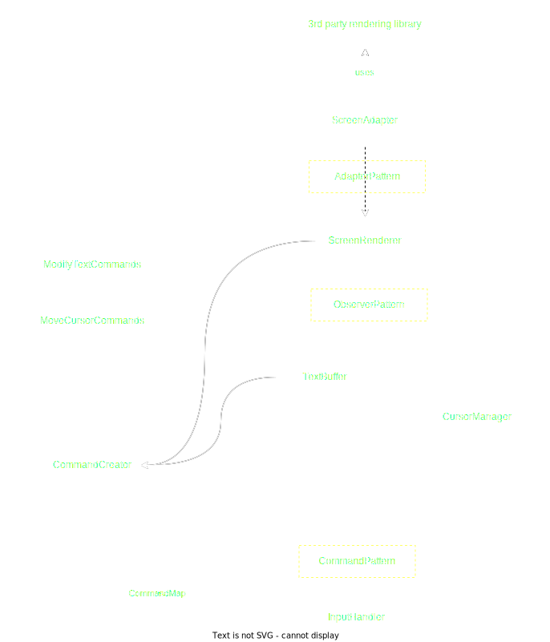

# Text Editor [Work in Progress]
This project is for practicing and enhancing software skills in modern C++, TDD, OOP, and design patterns.
- Build Tool: CMake
- Development Environment: Docker Container
- Language: C++
- Unit Testing Framework: GoogleTest

## Core Components:

- Text Buffer: This is where the text content is stored.
- Cursor Management: Manages the position of the cursor in the text buffer.
- Input Handling: Interprets user input as commands.
- Screen Rendering: Updates the terminal display to reflect the current state of the text buffer and cursor position.

## Applied Technologies and Methodologies
### Design Patterns
- Observer Pattern: To implement the communication between `TextBuffer`, `CursorManager` and `ScreenRenderer`.
- Command Pattern: To make the commands scalable without modifying `InputHandler`.
- Adapter Pattern: To be able to replace the 3rd party renderering library without modifying `ScreenRenderer` too much.
### C++
- Abstract Classes & Interfaces: For SOLID principles and to enhance testability.
- Templates: To ease the implementation of Observer Pattern
- Smart Pointers: For automatic resource management
- Multithreading: To run the rendering of the screen and the detection of user input.
### Unit-Testing
- TDD, GoogleTest, GoogleMock, Arrange-Act-Assert Pattern
### Build & Code Quality Tools
- CMake, CMake Presets, Clang-Format, Clang-Tidy
### Environemnt Management Tools
- Docker, Docker Compose, Dev Container
### Continuous Integration
- Github Actions

## Learnings & Possible Improvements
- Separating test and source files enables cleaner project structure, but introduces a small navigation overhead when practicing TDD.
- Thinking about SOLID principles really helps designing a class, improving testability, and decoupling objects.
- Should have integrated clang-tidy and GithubActions at beginning of the project. However Clang-Tidy significantly slows down the build-time.
- Dev Container for development is very handy.
- Design patterns are very useful for many problems. Problems probably can be solved without such patterns, but then the code quality is likely to suffer.
- It is intuitive to implement one component after another, but it might have turned out qualitatively better, if I did slices across all components (agile development).
- Smart Pointers for heap allocated objects and references for stack-allocated.
- At least one more abstraction layer between main function and text editor application. Could create a class TextEditor containing the components, instead of putting everything together in the main function (Facade pattern).
- A configuration file to specify e.g. if it has border, uses Mouse tracking, etc.
- Prettier argument-handling using 3rd party library [Argengine](https://github.com/juzzlin/Argengine). Possible to take a json configuration file.
